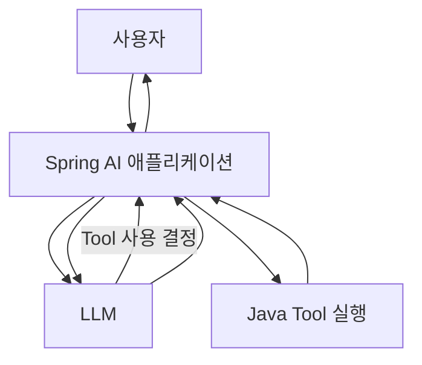
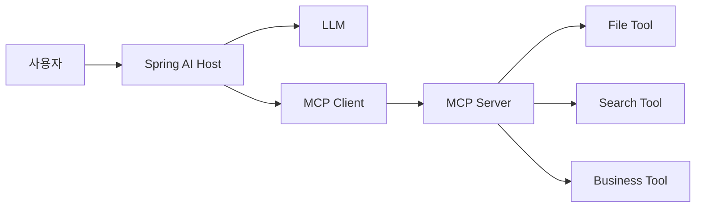
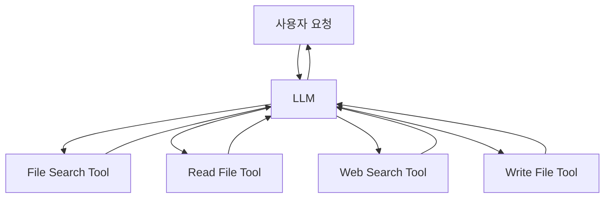

# Spring AI Tool Calling 및 MCP Server 개발

> 본 문서는 「[인공지능] Spring AI Tool 호출 및 MCP Server 개발」 과정안내서와 수업 흐름을 바탕으로 재구성한 학습 교재입니다.  
> 원 수업의 핵심 순서인 **Tool Calling → STDIO MCP Server → WebMVC/WebFlux 기반 MCP → 파일 시스템 → 인터넷 검색 → 비전 Tool**을 유지하되, 초보자가 개념과 코드의 연결 관계를 이해할 수 있도록 학습 순서를 세분화했습니다.
>
> **검토 기준:** 과정안내서의 수업 구성은 그대로 보존하고, 기술 설명은 2026-09-12 기준 Spring AI 공식 문서(2.0.1)를 함께 확인해 보완했습니다. 특히 원 수업의 SSE 예제는 학습 대상으로 유지하되, 현재 Spring AI 2.0 계열에서는 SSE transport가 deprecated이며 새 프로젝트에는 Streamable HTTP 사용이 권장된다는 점을 별도로 표시했습니다.

---

## 교재 개요

### 교육 목표

이 교재의 목표는 Spring AI에서 LLM에게 외부 기능을 제공하는 방법을 이해하고, 애플리케이션 내부 Tool과 MCP Server 기반 외부 Tool을 단계적으로 구현하는 것입니다.

학습을 마치면 다음 내용을 설명하고 구현할 수 있어야 합니다.

1. LLM이 직접 프로그램을 실행하지 못하는 이유를 설명할 수 있다.
2. Spring AI의 Tool Calling 구조를 설명할 수 있다.
3. Java 메서드를 LLM이 사용할 수 있는 Tool로 제공할 수 있다.
4. MCP의 Host, Client, Server 구조를 설명할 수 있다.
5. STDIO 기반 MCP Server의 동작 방식을 설명할 수 있다.
6. Web 기반 MCP Server의 구조를 이해할 수 있다.
7. 파일 시스템, 인터넷 검색, 비전 기능을 Tool로 확장할 수 있다.
8. 여러 Tool을 결합한 AI 애플리케이션의 전체 흐름을 설계할 수 있다.

### 선수 지식

- Java 기본 문법
- Spring Boot 애플리케이션 개발 경험
- Spring AI의 ChatClient 기본 사용법
- REST API에 대한 기초 이해
- JSON 구조에 대한 기초 이해

### 원 과정 구성

| 단원 | 시간 | 주요 내용 |
|---|---:|---|
| Tool Calling | 2시간 | 애플리케이션 내부 Tool 정의 및 호출 |
| STDIO 통신 MCP Server 개발 | 5시간 | 애플리케이션과 연결되는 MCP Server 외부 Tool 정의 및 호출 |
| SSE 통신 MCP Server 개발 | 5시간 | 독립 실행 MCP Server와 외부 Tool 정의 및 호출 |
| 합계 | 12시간 | 이론 + 실습 |

---

# 제1장. Spring AI Tool과 MCP를 왜 배우는가

## 1.1 일반적인 LLM의 한계

LLM은 사용자의 질문을 이해하고 자연어 답변을 생성하는 데 강점이 있습니다. 그러나 기본 상태의 LLM은 다음과 같은 작업을 직접 수행하지 못합니다.

- 현재 시각 확인
- 데이터베이스 조회
- 사내 시스템 호출
- 파일 읽기와 저장
- 인터넷 검색
- 외부 API 호출
- 다른 애플리케이션 기능 실행

예를 들어 사용자가 다음과 같이 질문했다고 가정합니다.

```text
현재 서울 날씨를 알려줘.
```

LLM이 학습 과정에서 얻은 지식만 사용한다면 현재 시점의 날씨를 정확하게 알 수 없습니다. 최신 날씨 정보를 얻으려면 외부 날씨 API 또는 검색 기능이 필요합니다.

이때 LLM에게 외부 기능을 연결하는 대표적인 방법이 **Tool Calling**입니다.

---

## 1.2 Tool Calling이란 무엇인가

Tool Calling은 LLM이 직접 Java 메서드를 실행하는 기능이 아닙니다.

LLM은 다음 두 가지를 판단합니다.

1. 현재 질문에 Tool이 필요한가?
2. 필요하다면 어떤 Tool을 어떤 인자로 호출해야 하는가?

실제 Tool 실행은 Spring AI 애플리케이션이 담당합니다.

### 동작 구조



핵심은 다음 문장으로 정리할 수 있습니다.

> LLM은 Tool을 선택하고, 애플리케이션은 Tool을 실행한다.

---

## 1.3 MCP가 필요한 이유

Tool이 몇 개 없고 모두 같은 Spring Boot 애플리케이션 안에 있다면 내부 Tool만으로 충분합니다.

그러나 프로젝트가 커지면 문제가 달라집니다.

- 파일 처리 기능은 별도 프로그램에서 관리하고 싶다.
- 검색 기능을 여러 AI 애플리케이션에서 함께 사용하고 싶다.
- 데이터베이스 Tool을 다른 서비스에서도 재사용하고 싶다.
- Java가 아닌 다른 언어로 만든 Tool도 연결하고 싶다.
- Tool 제공 애플리케이션과 AI 애플리케이션을 분리하고 싶다.

이 문제를 해결하기 위해 Tool 제공 방식을 표준화하는 구조가 필요합니다. MCP는 AI 애플리케이션과 외부 Tool 제공 시스템 사이의 연결 규칙을 제공합니다.

---

## 1.4 Tool Calling과 MCP의 관계

| 구분 | Tool Calling | MCP |
|---|---|---|
| 목적 | LLM이 기능을 선택하고 실행하도록 연결 | 외부 Tool을 표준 방식으로 연결 |
| 실행 위치 | 주로 같은 애플리케이션 내부 | 별도 프로세스 또는 별도 서버 가능 |
| 대표 구조 | LLM → Java Method | MCP Client → MCP Server → Tool |
| 재사용성 | 애플리케이션 내부 중심 | 여러 애플리케이션에서 재사용하기 유리 |
| 주요 학습 포인트 | Tool 정의, 설명, 파라미터 | Client/Server, 통신, 외부 Tool |

Tool Calling을 이해한 뒤 MCP를 배우는 이유는 MCP도 결국 LLM이 사용할 수 있는 Tool을 확장하는 구조이기 때문입니다.

---

## 1.5 Chat에서 Agent로 확장되는 흐름

```text
일반 Chat
   ↓
Tool Calling
   ↓
외부 기능 실행
   ↓
MCP 기반 Tool 확장
   ↓
여러 Tool 조합
   ↓
Agentic AI
```

Tool Calling과 MCP는 단순한 API 호출 문법이 아니라 AI 애플리케이션이 실제 업무를 수행하도록 확장하는 기반 기술입니다.

---

# 제2장. Spring AI Tool Calling 기초

## 2.1 첫 번째 Tool 만들기

가장 먼저 외부 API나 데이터베이스를 사용하지 않는 간단한 Java Tool부터 시작합니다.

### 개념 예제

```java
import java.time.LocalDateTime;
import org.springframework.ai.tool.annotation.Tool;

public class DateTimeTools {

    @Tool(description = "현재 날짜와 시간을 조회합니다.")
    public String getCurrentDateTime() {
        return LocalDateTime.now().toString();
    }
}
```

여기서 중요한 부분은 `@Tool`입니다.

평범한 Java 메서드에 Tool 정보를 제공하면 Spring AI가 LLM에게 이 메서드의 존재와 사용 목적을 알려줄 수 있습니다.

---

## 2.2 Tool description이 중요한 이유

다음 두 코드를 비교해 봅니다.

### 좋지 않은 예

```java
@Tool(description = "검색")
public String search(String query) {
    ...
}
```

### 개선된 예

```java
@Tool(
    description = "사용자의 질문에 최신 인터넷 정보가 필요한 경우 웹을 검색합니다."
)
public String search(String query) {
    ...
}
```

LLM은 Tool 이름만 보는 것이 아니라 Tool 설명을 이용해 어떤 상황에서 이 Tool을 사용할지 판단합니다.

따라서 Tool 설명은 단순한 주석이 아닙니다.

### Tool 설명 작성 원칙

1. Tool이 무엇을 하는지 명확하게 적는다.
2. 언제 사용해야 하는지 설명한다.
3. 다른 Tool과 역할이 겹치지 않도록 한다.
4. 지나치게 짧거나 모호한 표현을 피한다.

---

## 2.3 Tool 파라미터 이해

Tool이 입력값을 받는 경우 LLM은 각 파라미터의 의미와 필수 여부도 알아야 합니다. Spring AI에서는 `@ToolParam`을 사용해 파라미터 설명을 명확하게 전달할 수 있습니다.

```java
import org.springframework.ai.tool.annotation.Tool;
import org.springframework.ai.tool.annotation.ToolParam;

public class SearchTools {

    @Tool(description = "사용자의 질문에 최신 인터넷 정보가 필요한 경우 웹을 검색합니다.")
    public String search(
            @ToolParam(description = "검색할 질문") String query) {
        // 실제 검색 API 호출
        return "...";
    }
}
```

Spring AI는 메서드의 파라미터 정보를 바탕으로 LLM에 전달할 JSON Schema를 생성합니다. 개념적으로는 다음과 같은 구조입니다.

```json
{
  "type": "object",
  "properties": {
    "query": {
      "type": "string",
      "description": "검색할 질문"
    }
  },
  "required": ["query"]
}
```

LLM은 Tool 이름과 설명, 입력 JSON Schema를 함께 보고 어떤 Tool을 어떤 인자로 호출할지 결정합니다. Spring AI에서 Tool 파라미터는 기본적으로 필수이며, 선택 항목이 필요하면 `@ToolParam(required = false)` 등으로 명시합니다.

---

## 2.4 Tool Calling 전체 흐름

사용자가 다음과 같이 질문한다고 가정합니다.

```text
현재 시간을 알려줘.
```

실행 과정은 다음과 같습니다.

① 사용자가 Spring AI 애플리케이션에 질문을 보낸다.  
② Spring AI는 질문과 사용 가능한 Tool 정보를 LLM에게 전달한다.  
③ LLM은 현재 시간이 필요하므로 시간 조회 Tool을 선택한다.  
④ LLM은 Tool 호출에 필요한 인자를 생성한다.  
⑤ Spring AI가 실제 Java 메서드를 실행한다.  
⑥ Tool 실행 결과를 LLM에게 다시 전달한다.  
⑦ LLM이 실행 결과를 자연어 문장으로 정리한다.  
⑧ 최종 응답을 사용자에게 반환한다.

---

# 제3장. Tool Calling 내부 구조 이해

## 3.1 Tool은 세 가지 정보로 이해하면 쉽다

Tool은 크게 다음 세 요소로 구성됩니다.

```text
Tool 이름
   +
Tool 설명
   +
입력 파라미터 구조
```

LLM은 이 정보를 바탕으로 Tool 사용 여부를 판단합니다.

---

## 3.2 Tool Definition과 JSON Schema

Tool을 LLM에게 전달하려면 LLM이 이해할 수 있는 구조화된 정보가 필요합니다.

예를 들어 Java 코드가 다음과 같다고 가정합니다.

```java
public String getWeather(String city)
```

LLM에게는 개념적으로 다음과 같은 정보가 전달됩니다.

```json
{
  "name": "getWeather",
  "description": "지정한 도시의 날씨를 조회합니다.",
  "parameters": {
    "type": "object",
    "properties": {
      "city": {
        "type": "string",
        "description": "날씨를 조회할 도시 이름"
      }
    },
    "required": ["city"]
  }
}
```

이 구조를 이해하면 Tool Calling이 마법처럼 동작하는 기능이 아니라, **LLM과 애플리케이션이 구조화된 정보를 주고받는 과정**이라는 점을 이해할 수 있습니다.

---

## 3.3 여러 Tool을 제공하면 어떻게 되는가

다음과 같은 Tool이 있다고 가정합니다.

```text
getCurrentTime()
getWeather(city)
searchWeb(query)
readFile(path)
```

사용자가 질문할 때 LLM은 질문의 의도와 각 Tool의 설명을 비교합니다.

예를 들어,

```text
서울의 오늘 날씨는 어때?
```

라는 질문에서는 `getWeather`가 선택될 가능성이 높습니다.

반면,

```text
오늘 발표된 Spring AI 관련 소식을 찾아줘.
```

라는 질문에서는 최신 정보가 필요하므로 `searchWeb` 같은 검색 Tool이 더 적절합니다.

따라서 Tool이 많아질수록 Tool 이름과 설명의 품질이 중요해집니다.

---

## 3.4 초보자가 자주 혼동하는 부분

### (1) LLM이 Java 메서드를 직접 실행하는가?

아닙니다. LLM은 Tool 호출 요청을 생성하고 실제 실행은 애플리케이션이 담당합니다.

### (2) Tool은 반드시 외부 API여야 하는가?

아닙니다. 단순한 Java 메서드도 Tool이 될 수 있습니다.

### (3) 모든 질문에서 Tool이 실행되는가?

아닙니다. 질문 내용과 Tool 설명을 바탕으로 LLM이 Tool 사용 필요성을 판단합니다.

---

# 제4장. MCP 기본 개념

## 4.1 MCP의 핵심 역할

MCP를 처음 접하면 프로토콜, Client, Server, STDIO, SSE 같은 용어 때문에 어렵게 느껴질 수 있습니다.

핵심은 단순합니다.

> MCP는 AI 애플리케이션이 외부 기능을 일정한 방식으로 발견하고 호출하도록 연결하는 프로토콜이다.

MCP는 Client/Server 구조를 사용하며 메시지 교환은 JSON-RPC 기반으로 이루어집니다. 초보 단계에서는 먼저 **Host → MCP Client → MCP Server → Tool**의 역할 구분을 이해하는 것이 중요합니다.

---

## 4.2 MCP 주요 구성 요소

### MCP Host

사용자와 상호작용하는 AI 애플리케이션입니다.

예:

```text
Spring Boot + Spring AI 애플리케이션
```

### MCP Client

MCP Server와 통신하는 구성 요소입니다.

Host 내부에서 외부 MCP Server와 연결을 담당합니다.

### MCP Server

외부 Tool을 제공하는 서버 또는 프로세스입니다.

예:

```text
파일 시스템 MCP Server
검색 MCP Server
데이터베이스 MCP Server
업무 시스템 MCP Server
```

---

## 4.3 MCP 전체 구조



---

## 4.4 MCP Tool 호출 흐름

MCP Tool 호출은 다음 흐름으로 이해하면 됩니다.

① MCP Client가 MCP Server에 연결한다.  
② Client가 Server에서 제공하는 Tool 목록을 확인한다.  
③ 사용자가 질문한다.  
④ LLM이 필요한 Tool을 판단한다.  
⑤ MCP Client가 MCP Server에 Tool 실행을 요청한다.  
⑥ MCP Server가 실제 Tool을 실행한다.  
⑦ 실행 결과를 MCP Client에 반환한다.  
⑧ 결과가 LLM에게 전달된다.  
⑨ LLM이 최종 답변을 생성한다.

---

# 제5장. STDIO 기반 MCP Server

## 5.1 STDIO란 무엇인가

STDIO는 Standard Input/Output의 약자로 표준 입력과 표준 출력을 뜻합니다.

STDIO 방식에서는 MCP Client와 MCP Server가 표준 입력(stdin)과 표준 출력(stdout)을 이용해 메시지를 주고받습니다. 일반적인 로컬 구성에서는 Host 애플리케이션이 MCP Server 프로세스를 실행하거나 이미 준비된 로컬 프로세스와 연결합니다. 핵심은 네트워크 포트가 아니라 표준 입출력 스트림을 통신 채널로 사용한다는 점입니다.

```text
Spring AI Application
        │
        │ MCP Client
        │
        ├──── stdin ────▶ MCP Server Process
        │
        ◀─── stdout ─────
```

---

## 5.2 STDIO 방식을 먼저 배우는 이유

STDIO는 네트워크 서버 설정 없이 MCP의 Client/Server 구조를 이해하기 좋습니다.

학습자는 먼저 다음 내용을 확인할 수 있습니다.

- MCP Client와 MCP Server의 역할이 분리된다는 점
- 로컬 구성에서 Client가 Server 프로세스를 실행하거나 연결할 수 있다는 점
- Tool 목록을 Server에서 가져올 수 있다는 점
- Tool 실행 결과가 다시 Client로 전달된다는 점

---

## 5.3 STDIO에서 로그 출력 주의

STDIO에서는 표준 출력이 통신 채널로 사용될 수 있습니다.

따라서 MCP 메시지와 무관한 콘솔 출력이 섞이지 않도록 주의해야 합니다.

좋지 않은 예:

```java
System.out.println("MCP Server 시작");
```

STDOUT을 통신에 사용하는 환경에서는 일반 로그를 별도 로깅 경로로 분리해야 합니다.

---

## 5.4 STDIO 실습에서 반드시 확인할 것

① MCP Server가 정상적으로 실행되는가?  
② MCP Client가 Server에 연결되는가?  
③ Client가 Tool 목록을 확인할 수 있는가?  
④ LLM이 MCP Tool을 선택하는가?  
⑤ Tool 실행 결과가 최종 응답에 반영되는가?

---

# 제6장. Web 기반 MCP Server

## 6.1 왜 Web 방식이 필요한가

STDIO는 같은 컴퓨터에서 실행되는 로컬 프로세스를 연결하기 좋습니다.

그러나 실제 서비스에서는 MCP Server를 별도의 서버로 운영해야 하는 경우가 많습니다.

```text
AI Application
      │
      │ Network
      ▼
MCP Server
      │
      ├─ Search
      ├─ File
      ├─ Database
      └─ Business API
```

이 구조에서는 MCP Server를 여러 AI 애플리케이션이 공통으로 사용할 수 있습니다.

---

## 6.2 원 수업의 SSE와 현재 권장 방식

과정안내서에서는 다음 두 가지 Spring 기반 SSE 구현을 다룹니다.

1. WebMVC 기반 SSE MCP Server
2. WebFlux 기반 SSE MCP Server

이 내용은 **원 수업의 학습 흐름**이므로 그대로 이해할 필요가 있습니다. 다만 2026-09-12 기준 Spring AI 2.0.1 공식 문서에서는 SSE transport가 2.0.0부터 deprecated로 표시되어 있으며, 새 프로젝트에는 **Streamable HTTP** 사용을 권장합니다.

따라서 교재에서는 다음과 같이 구분합니다.

| 구분 | 학습 목적 |
|---|---|
| SSE | 수업 소스 이해 및 기존 MCP 전송 방식 학습 |
| Streamable HTTP | 현재 Spring AI 2.0 계열에서 권장되는 HTTP 전송 방식 |
| Stateless | 세션 상태를 유지하지 않는 단순한 배포 구조가 필요한 경우 |

핵심 개념은 같습니다. 먼저 **Client와 Server가 네트워크로 분리된다**는 구조를 이해하고, 그 다음 전송 방식의 차이를 구분합니다.

---

## 6.3 Spring AI 2.0 계열의 Streamable HTTP

WebMVC 기반 MCP Server에서는 다음 starter를 사용할 수 있습니다.

```xml
<dependency>
    <groupId>org.springframework.ai</groupId>
    <artifactId>spring-ai-starter-mcp-server-webmvc</artifactId>
</dependency>
```

Streamable HTTP를 사용할 때 서버 설정의 핵심은 다음과 같습니다.

```properties
spring.ai.mcp.server.protocol=STREAMABLE
```

WebFlux를 사용하는 경우에는 WebFlux용 MCP Server starter를 사용합니다.

> **주의:** 수업 소스가 SSE를 기준으로 작성되어 있다면 실습 중에는 강의 소스의 설정을 우선합니다. 교재의 Streamable HTTP 설명은 현재 기술 흐름을 이해하기 위한 보완 내용입니다.

---

# 제7장. WebMVC와 WebFlux 이해

## 7.1 WebMVC

WebMVC는 전통적인 Spring MVC 기반 웹 애플리케이션 구조입니다.

초보자는 먼저 WebMVC 기반 MCP Server에서 다음 흐름을 이해하는 것이 좋습니다.

```text
MCP Client
   ↓
HTTP 요청
   ↓
Spring MVC
   ↓
MCP Server
   ↓
Tool 실행
   ↓
결과 반환
```

---

## 7.2 WebFlux

WebFlux는 Reactive Programming 모델을 사용하는 Spring의 비동기 웹 스택입니다.

Tool Calling과 MCP를 처음 배우는 단계에서는 WebFlux 문법 자체보다 다음 차이를 이해하는 데 집중합니다.

| 구분 | WebMVC | WebFlux |
|---|---|---|
| 프로그래밍 모델 | 전통적 요청/응답 | Reactive |
| 대표 타입 | 일반 객체 | Mono, Flux |
| 학습 난이도 | 상대적으로 낮음 | 상대적으로 높음 |
| 권장 학습 순서 | 먼저 학습 | 이후 확장 |

---

## 7.3 교재에서의 학습 순서

```text
WebMVC MCP 이해
        ↓
MCP Client와 Server 연결 확인
        ↓
Tool 호출 성공 확인
        ↓
WebFlux 구조 비교
        ↓
Reactive 방식 확장
```

두 방식을 처음부터 동시에 외우기보다 WebMVC에서 MCP 구조를 이해한 뒤 WebFlux로 확장하는 것이 좋습니다.

---

# 제8장. 로컬 파일 시스템 Tool

## 8.1 파일 시스템 Tool의 목적

파일 시스템 Tool은 LLM이 직접 파일을 읽는 것이 아니라 애플리케이션이 파일 관련 기능을 제공하고 LLM이 필요한 Tool을 선택하게 하는 구조입니다.

예:

```text
listFiles
readFile
writeFile
searchFiles
```

---

## 8.2 파일 읽기 흐름

```text
사용자
 "report.txt 내용을 요약해줘"
        ↓
LLM
 "readFile Tool이 필요하다"
        ↓
File Tool
        ↓
파일 내용 반환
        ↓
LLM
        ↓
요약 결과
```

---

## 8.3 파일 Tool의 핵심 보안 원칙

파일 Tool은 강력하지만 잘못 구현하면 위험합니다.

반드시 다음 사항을 고려합니다.

1. 접근 가능한 기준 디렉터리를 제한한다.
2. 사용자가 입력한 경로를 그대로 신뢰하지 않는다.
3. 상위 디렉터리 이동을 제한한다.
4. 삭제 기능은 별도 권한으로 관리한다.
5. 중요한 파일의 덮어쓰기를 방지한다.
6. Tool 호출 기록을 남긴다.

---

# 제9장. 인터넷 검색 Tool

## 9.1 왜 검색 Tool이 필요한가

LLM의 학습 데이터에는 최신 정보가 포함되지 않을 수 있습니다.

인터넷 검색 Tool을 연결하면 다음과 같은 질문에 대응할 수 있습니다.

```text
오늘 발표된 기술 뉴스를 찾아줘.
현재 환율을 검색해줘.
최신 Spring AI 관련 정보를 찾아줘.
```

---

## 9.2 검색 Tool 구조

```text
사용자 질문
    ↓
LLM
    ↓
검색 필요 여부 판단
    ↓
Search Tool
    ↓
외부 검색 API
    ↓
검색 결과
    ↓
LLM
    ↓
최종 응답
```

---

## 9.3 검색 Tool 구현 시 확인할 부분

- API Key는 환경변수로 관리한다.
- 검색 API의 응답 형식을 확인한다.
- 검색 결과가 비어 있는 경우를 처리한다.
- 네트워크 오류를 처리한다.
- 검색 결과 전체를 무조건 LLM에 전달하지 않는다.
- 필요한 내용만 정리해서 전달한다.

환경변수 사용 예:

```properties
app.search.api-key=${SEARCH_API_KEY}
```

API Key를 GitHub 저장소에 직접 커밋하지 않습니다.

---

# 제10장. 비전을 활용한 제어 Tool

## 10.1 Vision과 Tool Calling의 결합

비전 모델은 이미지를 분석할 수 있습니다.

여기에 Tool Calling을 결합하면 다음 구조를 만들 수 있습니다.

```text
이미지 입력
   ↓
Vision Model
   ↓
상태 판단
   ↓
필요한 Tool 선택
   ↓
외부 기능 실행
```

예를 들어 이미지에서 특정 상태를 확인한 뒤 관련 제어 Tool을 호출하도록 설계할 수 있습니다.

---

## 10.2 핵심은 '판단'과 '실행'의 분리

```text
Vision Model = 이미지 해석과 판단
Tool         = 실제 기능 실행
```

AI 모델이 직접 시스템을 제어하는 것으로 이해하면 안 됩니다.

실제 작업은 애플리케이션의 Tool이 수행합니다.

---

# 제11장. 종합 프로젝트

## 11.1 목표

지금까지 학습한 내용을 하나의 AI 애플리케이션으로 연결합니다.

예를 들어 사용자가 다음과 같이 요청한다고 가정합니다.

```text
오늘 작성한 보고서 파일을 찾아서 요약하고,
관련된 최신 정보를 인터넷에서 검색한 다음
결과를 새로운 파일로 저장해줘.
```

이 요청에는 여러 Tool이 필요합니다.

```text
파일 검색
   ↓
파일 읽기
   ↓
내용 요약
   ↓
인터넷 검색
   ↓
결과 정리
   ↓
파일 저장
```

---

## 11.2 종합 구조



---

## 11.3 이 단계에서 Agent 개념과 연결된다

단일 Tool 호출은 비교적 단순합니다.

그러나 하나의 목표를 해결하기 위해 모델이 상황을 판단하고 여러 Tool을 선택·반복 실행하도록 구성하면 Agentic Workflow로 확장할 수 있습니다. 단순히 Tool을 여러 개 등록했다고 해서 자동으로 Agent가 되는 것은 아닙니다.

```text
단일 질문
   ↓
단일 Tool
   ↓
복수 Tool
   ↓
Tool 선택과 반복
   ↓
Agentic Workflow
```

Tool Calling과 MCP는 이후 AI Agent를 학습하기 위한 기반 기술입니다.

---

# 제12장. MCP와 Tool 개발 시 보안 및 운영 고려사항

## 12.1 API Key 관리

다음과 같이 소스에 API Key를 직접 작성하면 안 됩니다.

```properties
spring.ai.openai.api-key=sk-xxxx
```

환경변수를 사용합니다.

```properties
spring.ai.openai.api-key=${OPENAI_API_KEY}
```

---

## 12.2 HTTP 기반 MCP Server의 인증·인가

Spring AI의 HTTP 기반 MCP Server starter는 MCP endpoint에 인증·인가를 자동으로 적용하지 않습니다. 기본 상태로 외부 네트워크에 노출하면 접근 가능한 Client가 등록된 Tool, Resource, Prompt를 조회하거나 호출할 수 있습니다.

따라서 localhost를 넘어 배포할 때는 Spring Security 등의 보안 계층을 별도로 적용해야 합니다.

```text
외부 Client
    ↓
인증 / 인가
    ↓
MCP Endpoint
    ↓
Tool 실행
```

---

## 12.3 위험도가 높은 Tool은 별도로 관리한다

다음 Tool은 단순 조회 Tool보다 위험합니다.

- 파일 삭제
- 데이터 수정
- 이메일 전송
- 결제
- 운영 서버 명령 실행
- 계정 및 권한 변경

이러한 Tool에는 별도 승인 절차나 권한 검사가 필요합니다.

---

## 12.4 Tool 입력값 검증

LLM이 생성한 인자를 그대로 신뢰해서는 안 됩니다.

```text
LLM이 생성한 Tool Argument
        ↓
입력값 검증
        ↓
권한 확인
        ↓
실제 Tool 실행
```

---

## 12.5 로그 관리

운영 환경에서는 다음 정보를 기록하는 것이 좋습니다.

- 어떤 사용자가 요청했는가
- 어떤 Tool이 선택되었는가
- 어떤 인자가 전달되었는가
- Tool 실행이 성공했는가
- 오류가 발생했는가
- 실행 시간이 얼마나 걸렸는가

민감정보는 로그에 그대로 기록하지 않습니다.

---

# 제13장. 전체 학습 흐름 정리

## 13.1 핵심 흐름

```text
Spring AI Chat
    ↓
Tool Calling
    ↓
Java Tool
    ↓
여러 Tool
    ↓
MCP 개념
    ↓
MCP Client / Server
    ↓
STDIO MCP
    ↓
Web 기반 MCP
    ↓
File Tool
    ↓
Search Tool
    ↓
Vision Tool
    ↓
복수 Tool 조합
    ↓
Agentic AI
```

---

## 13.2 반드시 기억할 핵심 문장

### Tool Calling

> LLM은 Tool을 직접 실행하는 것이 아니라 어떤 Tool을 어떤 인자로 사용할지 결정한다.

### MCP

> MCP는 AI 애플리케이션과 외부 Tool 제공 시스템을 표준적인 Client/Server 구조로 연결한다.

### Agent

> Agent는 목표를 해결하기 위해 상황을 판단하고 필요한 Tool을 선택하여 여러 단계를 수행한다.

---

# 제14장. 실습 프로젝트 구성 계획

이 저장소에서는 수업 소스를 다음 구조로 정리하는 것을 목표로 합니다.

```text
springai-20260702/
├── 01-tool-calling/
├── 02-tool-calling-llm/
├── 03-mcp-stdio-server/
├── 04-mcp-stdio-client/
├── 05-mcp-webmvc-server/
├── 06-mcp-webmvc-client/
├── 07-mcp-webflux-server/
├── 08-mcp-webflux-client/
├── 09-file-system-tool/
├── 10-internet-search-tool/
├── 11-vision-tool/
└── README.md
```

각 프로젝트는 다음 기준으로 정리합니다.

1. 독립 실행 가능한 Spring Boot 프로젝트
2. API Key 및 비밀번호는 환경변수로 분리
3. 초보자가 이해할 수 있도록 핵심 코드에 주석 추가
4. 프로젝트별 실행 방법 제공
5. 정상 실행 결과 확인 방법 제공
6. 앞 프로젝트와 달라진 부분을 명확하게 표시
7. 불필요한 의존성과 설정 최소화

---

# 제15장. 효과적인 학습 방법

## 15.1 처음부터 모든 코드를 외우지 않는다

다음 세 가지를 먼저 이해합니다.

```text
누가 판단하는가?
누가 실행하는가?
결과가 어디로 돌아가는가?
```

Tool Calling에서는 다음처럼 답할 수 있어야 합니다.

```text
LLM → Tool 선택
Spring AI → Tool 실행
Tool → 실행 결과 반환
LLM → 최종 답변 생성
```

---

## 15.2 프로젝트를 실행한 뒤 코드를 읽는다

추천 순서는 다음과 같습니다.

① 프로젝트를 실행한다.  
② 정상 결과를 확인한다.  
③ 어떤 질문에서 Tool이 실행되는지 확인한다.  
④ Tool 클래스를 확인한다.  
⑤ ChatClient와 Tool 연결 코드를 확인한다.  
⑥ 설정 파일을 확인한다.  
⑦ 일부 값을 변경하고 다시 실행한다.

---

## 15.3 앞 프로젝트와의 차이를 찾는다

MCP 실습에서는 매 프로젝트를 처음부터 새로 이해하려고 하지 않습니다.

다음 질문을 반복합니다.

```text
이전 프로젝트와 무엇이 같은가?
무엇이 새로 추가되었는가?
통신 방식은 무엇이 달라졌는가?
Tool은 어디에서 실행되는가?
```

이 방식으로 보면 STDIO, WebMVC, WebFlux 프로젝트의 차이가 훨씬 명확해집니다.

---

# 부록 A. 수업 일정과 교재 대응표

| 수업 내용 | 교재 |
|---|---|
| 애플리케이션 내부 Tool 정의 | 제2장 |
| 내부 Tool + LLM 활용 | 제2장~제3장 |
| MCP 통신 방식 이해 | 제4장 |
| STDIO MCP Server 외부 Tool 정의 | 제5장 |
| STDIO MCP Server + LLM 활용 | 제5장 |
| WebMVC 기반 MCP Server | 제6장~제7장 |
| WebFlux 기반 MCP Server | 제7장 |
| 로컬 파일 시스템 Tool | 제8장 |
| 인터넷 검색 Tool | 제9장 |
| 비전을 활용한 제어 Tool | 제10장 |
| 종합 활용 | 제11장~제13장 |

---

# 부록 B. 실습 전 체크리스트

## Java / Spring

```bash
java -version
```

확인 항목:

- JDK 버전
- Maven 또는 Maven Wrapper 사용 가능 여부
- Spring Boot 프로젝트 실행 여부
- 프로젝트의 Spring AI 버전
- MCP 전송 방식(STDIO / SSE / STREAMABLE / STATELESS)
- 수업 소스와 공식 문서의 버전 차이 여부

## OpenAI API Key

macOS / Linux:

```bash
export OPENAI_API_KEY="본인의_API_KEY"
```

Windows PowerShell:

```powershell
$env:OPENAI_API_KEY="본인의_API_KEY"
```

API Key는 GitHub 저장소에 직접 저장하지 않습니다.

---

# 부록 C. 문제 해결 체크리스트

실습이 정상적으로 동작하지 않을 때는 다음 순서로 확인합니다.

① 애플리케이션이 정상 기동되었는가?  
② 필요한 환경변수가 설정되었는가?  
③ LLM API 호출 자체가 성공하는가?  
④ Tool이 애플리케이션에 등록되었는가?  
⑤ Tool description과 파라미터가 명확한가?  
⑥ MCP Client와 Server가 연결되었는가?  
⑦ STDIO 사용 시 불필요한 표준 출력이 섞이지 않았는가?  
⑧ Web 기반 MCP라면 포트 충돌이 없는가?  
⑨ 외부 API를 사용한다면 API Key와 네트워크 연결이 정상인가?  
⑩ 로그에서 실제 오류가 발생한 최초 지점을 확인했는가?

---

## 검토 반영 사항

이번 검토에서 다음 내용을 수정·보완했습니다.

1. 과정안내서의 단원명을 임의로 바꾸지 않고 `SSE 통신 MCP Server 개발`로 원문에 맞췄습니다.
2. Tool 파라미터 설명을 실제 Spring AI의 `@ToolParam`과 JSON Schema 구조에 맞게 수정했습니다.
3. STDIO를 무조건 "별도 프로세스"라고 단정하지 않고, 표준 입출력 기반 통신이라는 핵심 개념으로 바로잡았습니다.
4. 원 수업의 SSE는 유지하되 Spring AI 2.0 계열에서 SSE가 deprecated임을 명시하고 Streamable HTTP를 현재 권장 방식으로 추가했습니다.
5. 검색 API Key 예시를 실제 Spring 설정에서 사용할 수 있는 property placeholder 형태로 수정했습니다.
6. HTTP 기반 MCP Server는 기본 인증·인가가 제공되지 않는다는 보안 주의사항을 추가했습니다.
7. 여러 Tool을 등록하는 것과 Agentic Workflow를 동일시하지 않도록 설명을 보완했습니다.
8. 실제 압축파일의 프로젝트 코드와 아직 1:1 검증되지 않은 부분을 명확히 표시했습니다.

---

## 마무리

이 교재에서 가장 중요한 것은 개별 annotation이나 설정값을 외우는 것이 아닙니다.

전체 구조를 다음과 같이 이해하는 것이 우선입니다.

```text
사용자의 목표
     ↓
LLM의 판단
     ↓
Tool 선택
     ↓
애플리케이션 또는 MCP Server에서 실제 기능 실행
     ↓
실행 결과 반환
     ↓
LLM의 최종 응답
```

이 구조가 이해되면 파일 처리, 인터넷 검색, 데이터베이스, 사내 API, 비전 제어 등 다양한 기능을 같은 원리로 확장할 수 있습니다.

---

## 참고

- 과정명: [인공지능] Spring AI Tool 호출 및 MCP Server 개발
- 교육수준: 중급
- 교육시간: 12시간
- 선수지식: Spring Boot 애플리케이션 개발, Spring AI 기초
- 원 수업의 세부 예제 코드는 저장소에 프로젝트 단위로 단계적으로 정리할 예정입니다.
- 현재 README의 Java 코드는 개념 설명용 예제이며, 업로드된 압축파일 내부 프로젝트와 1:1로 대조된 최종 실행 코드는 아닙니다.
- 실제 실습 프로젝트를 저장소에 추가할 때는 각 프로젝트의 `pom.xml`, Spring AI 버전, MCP transport 설정을 기준으로 다시 검증합니다.

### 기술 검토 참고 문서

- Spring AI Tool Calling: https://docs.spring.io/spring-ai/reference/api/tools.html
- Spring AI MCP Overview: https://docs.spring.io/spring-ai/reference/api/mcp/mcp-overview.html
- Spring AI MCP Server Boot Starter: https://docs.spring.io/spring-ai/reference/api/mcp/mcp-server-boot-starter-docs.html
- Spring AI Streamable HTTP MCP Server: https://docs.spring.io/spring-ai/reference/api/mcp/mcp-streamable-http-server-boot-starter-docs.html
