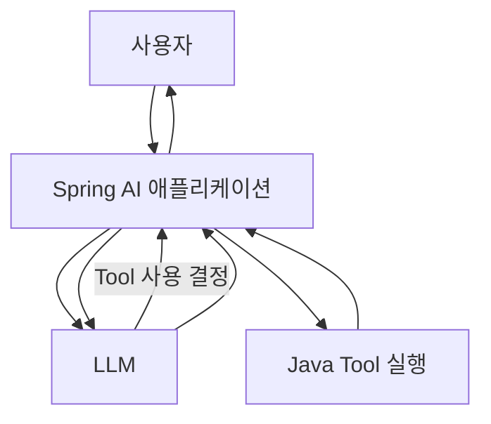
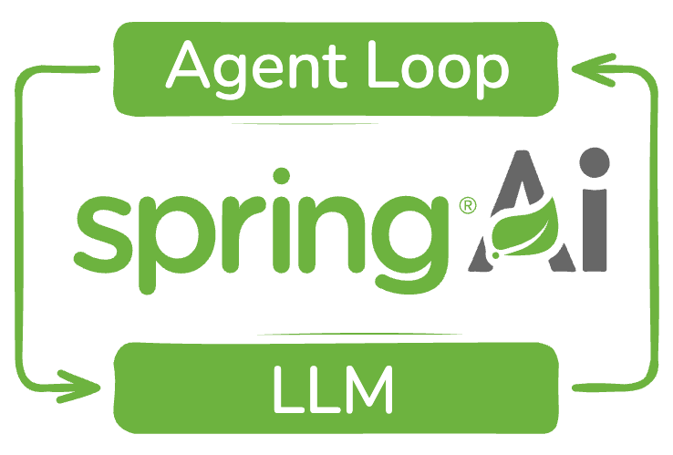
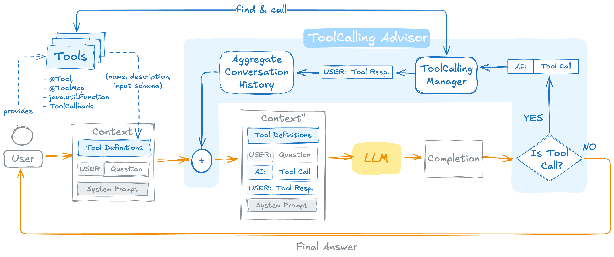
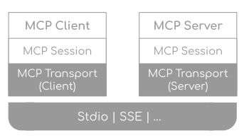
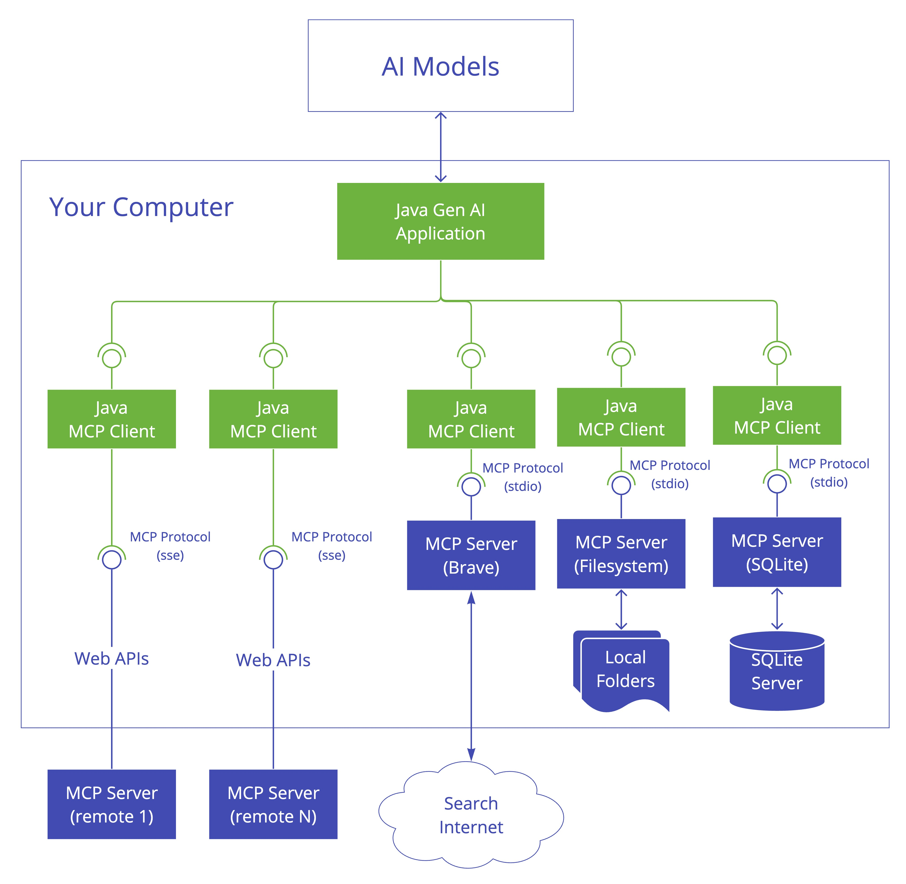
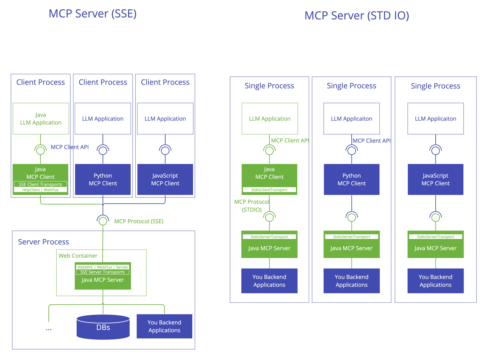

# Spring AI Tool Calling 및 MCP Server 개발

> 본 문서는 「[인공지능] Spring AI Tool 호출 및 MCP Server 개발」 과정안내서와 수업 흐름을 바탕으로 재구성한 학습 교재입니다.  
> 원 수업의 핵심 순서인 **Tool Calling → STDIO MCP Server → WebMVC/WebFlux 기반 MCP → 파일 시스템 → 인터넷 검색 → 비전 Tool**을 유지하되, 초보자가 개념과 코드의 연결 관계를 이해할 수 있도록 학습 순서를 세분화했습니다.
>
> **현재 저장소 기준:** 과정안내서에는 SSE 통신이 포함되어 있지만, `projects-spring-ai-2.0`의 실제 WebMVC/WebFlux MCP 소스는 `STREAMABLE` 프로토콜과 `streamable-http` 연결 설정을 사용합니다. 따라서 이 README는 과정의 의도는 유지하되, 실행과 코드 설명은 현재 `main` 브랜치의 실제 소스를 우선 기준으로 합니다.

---

## 교재 개요

### 교육 목표

이 교재의 목표는 Spring AI에서 LLM에게 외부 기능을 제공하는 방법을 이해하고, 애플리케이션 내부 Tool과 MCP Server 기반 외부 Tool을 단계적으로 구현하는 것입니다.

학습을 마치면 다음 내용을 설명하고 구현할 수 있어야 합니다.

1. LLM이 직접 프로그램을 실행하지 못하는 이유를 설명할 수 있다.
2. Spring AI의 Tool Calling 구조를 설명할 수 있다.
3. Java 메서드를 LLM이 사용할 수 있는 Tool로 제공할 수 있다.
4. MCP의 Host, Client, Server 구조를 설명할 수 있다.
5. STDIO 기반 MCP Server의 동작 방식을 설명할 수 있다.
6. Web 기반 MCP Server의 구조를 이해할 수 있다.
7. 파일 시스템, 인터넷 검색, 비전 기능을 Tool로 확장할 수 있다.
8. 여러 Tool을 결합한 AI 애플리케이션의 전체 흐름을 설계할 수 있다.

### 선수 지식

- Java 기본 문법
- Spring Boot 애플리케이션 개발 경험
- Spring AI의 ChatClient 기본 사용법
- REST API에 대한 기초 이해
- JSON 구조에 대한 기초 이해

### 초보자 주해 읽는 방법

본문에서 처음 접하면 이해하기 어려운 용어에는 **초보자 주해**를 붙였습니다. 주해는 용어를 외우기 위한 정의가 아니라, **현재 소스에서 그 코드가 왜 필요한지**를 빠르게 이해하기 위한 설명입니다.

> **초보자 주해 — 먼저 이것만 구분하세요**
>
> - **LLM**: 질문을 이해하고 다음에 할 일을 판단하는 두뇌
> - **Tool**: LLM이 필요할 때 사용하도록 애플리케이션이 제공하는 기능
> - **Spring AI**: Java/Spring 애플리케이션과 LLM을 연결해 주는 라이브러리
> - **MCP**: Tool을 다른 프로그램이나 서버에 두고도 일정한 방식으로 연결하기 위한 통신 규칙
>
> 처음에는 클래스명과 설정을 전부 외우지 말고 **“누가 판단하고, 누가 실제 실행하는가?”**만 계속 확인하면 됩니다.

### 원 과정 구성

| 단원 | 시간 | 주요 내용 |
|---|---:|---|
| Tool Calling | 2시간 | 애플리케이션 내부 Tool 정의 및 호출 |
| STDIO 통신 MCP Server 개발 | 5시간 | 애플리케이션과 연결되는 MCP Server 외부 Tool 정의 및 호출 |
| SSE 통신 MCP Server 개발 | 5시간 | 독립 실행 MCP Server와 외부 Tool 정의 및 호출 |
| 합계 | 12시간 | 이론 + 실습 |

---

# 제1장. Spring AI Tool과 MCP를 왜 배우는가

## 1.1 일반적인 LLM의 한계

LLM은 사용자의 질문을 이해하고 자연어 답변을 생성하는 데 강점이 있습니다. 그러나 기본 상태의 LLM은 다음과 같은 작업을 직접 수행하지 못합니다.

- 현재 시각 확인
- 데이터베이스 조회
- 사내 시스템 호출
- 파일 읽기와 저장
- 인터넷 검색
- 외부 API 호출
- 다른 애플리케이션 기능 실행

예를 들어 사용자가 다음과 같이 질문했다고 가정합니다.

```text
현재 서울 날씨를 알려줘.
```

LLM이 학습 과정에서 얻은 지식만 사용한다면 현재 시점의 날씨를 정확하게 알 수 없습니다. 최신 날씨 정보를 얻으려면 외부 날씨 API 또는 검색 기능이 필요합니다.

이때 LLM에게 외부 기능을 연결하는 대표적인 방법이 **Tool Calling**입니다.

> **초보자 주해 — LLM과 API**
>
> LLM은 사람처럼 문장을 이해하고 답을 만드는 모델입니다. 그러나 LLM 자체가 내 PC의 파일을 열거나 인터넷 사이트에 접속하는 것은 아닙니다.
>
> 외부 시스템의 기능을 프로그램에서 호출할 때 사용하는 통로를 보통 **API**라고 합니다. Tool Calling은 **LLM의 판단**과 **실제 Java/API 기능 실행**을 연결하는 역할을 합니다.

---

## 1.2 Tool Calling이란 무엇인가

Tool Calling은 LLM이 직접 Java 메서드를 실행하는 기능이 아닙니다.

LLM은 다음 두 가지를 판단합니다.

1. 현재 질문에 Tool이 필요한가?
2. 필요하다면 어떤 Tool을 어떤 인자로 호출해야 하는가?

실제 Tool 실행은 Spring AI 애플리케이션이 담당합니다.

### 동작 구조



핵심은 다음 문장으로 정리할 수 있습니다.

> LLM은 Tool을 선택하고, 애플리케이션은 Tool을 실행한다.

---

## 1.3 MCP가 필요한 이유

Tool이 몇 개 없고 모두 같은 Spring Boot 애플리케이션 안에 있다면 내부 Tool만으로 충분합니다.

그러나 프로젝트가 커지면 문제가 달라집니다.

- 파일 처리 기능은 별도 프로그램에서 관리하고 싶다.
- 검색 기능을 여러 AI 애플리케이션에서 함께 사용하고 싶다.
- 데이터베이스 Tool을 다른 서비스에서도 재사용하고 싶다.
- Java가 아닌 다른 언어로 만든 Tool도 연결하고 싶다.
- Tool 제공 애플리케이션과 AI 애플리케이션을 분리하고 싶다.

이 문제를 해결하기 위해 Tool 제공 방식을 표준화하는 구조가 필요합니다. MCP는 AI 애플리케이션과 외부 Tool 제공 시스템 사이의 연결 규칙을 제공합니다.

> **초보자 주해 — MCP는 무엇을 표준화하나요?**
>
> 휴대전화마다 충전 단자가 제각각이면 케이블을 따로 준비해야 합니다. MCP도 비슷합니다. 파일 Tool, 검색 Tool, 사내 시스템 Tool을 각각 다른 방식으로 연결하지 않고, **Host와 외부 Tool Server가 공통 규칙으로 대화하도록 만드는 것**이 핵심입니다.
>
> 이 저장소에서는 같은 종류의 Tool이 제11장에서는 애플리케이션 내부 `@Tool`로, 제12장에서는 외부 MCP Server의 `@McpTool`로 구현됩니다.

---

## 1.4 Tool Calling과 MCP의 관계

| 구분 | Tool Calling | MCP |
|---|---|---|
| 목적 | LLM이 기능을 선택하고 실행하도록 연결 | 외부 Tool을 표준 방식으로 연결 |
| 실행 위치 | 주로 같은 애플리케이션 내부 | 별도 프로세스 또는 별도 서버 가능 |
| 대표 구조 | LLM → Java Method | MCP Client → MCP Server → Tool |
| 재사용성 | 애플리케이션 내부 중심 | 여러 애플리케이션에서 재사용하기 유리 |
| 주요 학습 포인트 | Tool 정의, 설명, 파라미터 | Client/Server, 통신, 외부 Tool |

Tool Calling을 이해한 뒤 MCP를 배우는 이유는 MCP도 결국 LLM이 사용할 수 있는 Tool을 확장하는 구조이기 때문입니다.

---

## 1.5 Chat에서 Agent로 확장되는 흐름

<p align="center">
  
</p>

> 단순한 텍스트 응답을 넘어 LLM이 Tool을 사용하고 결과를 다시 판단하는 반복 구조를 보여줍니다. 제11장 Tool Calling과 이후 Agent 학습이 어떻게 연결되는지 먼저 큰 흐름으로 확인할 수 있습니다.

```text
일반 Chat
   ↓
Tool Calling
   ↓
외부 기능 실행
   ↓
MCP 기반 Tool 확장
   ↓
여러 Tool 조합
   ↓
Agentic AI
```

Tool Calling과 MCP는 단순한 API 호출 문법이 아니라 AI 애플리케이션이 실제 업무를 수행하도록 확장하는 기반 기술입니다.

---

# 제2장. 실제 소스로 시작하는 Spring AI Tool Calling

## 2.1 먼저 전체 구조를 본다

제11장 소스는 단순히 `@Tool` 하나만 보여주는 예제가 아닙니다. 하나의 Spring Boot 프로젝트 안에서 Tool Calling의 난이도를 단계적으로 높일 수 있도록 여러 예제가 함께 들어 있습니다.

```text
ch11-tool-calling/
└── src/main/java/com/example/demo/
    ├── datetime/
    ├── heatingsystem/
    ├── recommendmovie/
    ├── exceptionhandling/
    ├── boombarrier/
    ├── filesystem/
    ├── toolsearch/
    └── internetsearch/
```

처음부터 모든 패키지를 한꺼번에 이해하려고 하면 난이도가 급격히 올라갑니다. 실제 학습은 다음 순서가 적절합니다.

① `datetime` — 가장 단순한 Tool 등록과 호출  
② `heatingsystem` — Tool 파라미터와 `ToolContext`  
③ `recommendmovie` — 여러 Tool과 `returnDirect`  
④ `exceptionhandling` — Tool 실행 예외  
⑤ `boombarrier` — 이미지 + 여러 Tool 조합  
⑥ `filesystem` — 상태가 있는 대화 + 파일 Tool  
⑦ `toolsearch` — Tool이 많아졌을 때 필요한 Tool Search  
⑧ `internetsearch` — 외부 API를 사용하는 Tool

---

## 2.2 가장 먼저 볼 코드: DateTimeTools

실제 소스:

```java
@Component
public class DateTimeTools {

  @Tool(description = "현재 날짜와 시간 정보를 제공합니다.")
  public String getCurrentDateTime() {
    ...
  }

  @Tool(description = "지정된 시간에 알람을 설정합니다.")
  public void setAlarm(
      @ToolParam(description = "ISO-8601 형식의 시간", required = true)
      String time) {
    ...
  }
}
```

이 예제에서 먼저 확인할 것은 세 가지입니다.

- `@Component`: Spring Bean으로 등록
- `@Tool`: LLM에게 사용할 수 있는 Tool로 설명
- `@ToolParam`: LLM에게 파라미터의 의미를 설명

`@Tool`을 붙였다고 자동으로 모든 ChatClient가 이 Tool을 사용하는 것은 아닙니다. 실제 연결은 Service에서 합니다.

> **초보자 주해 — @Component, Bean, Annotation**
>
> - **Annotation(애노테이션)**: `@Tool`, `@Component`처럼 코드에 부가 정보를 붙이는 표시
> - **Spring Bean**: Spring이 생성하고 관리하는 Java 객체
> - `@Component`: “이 클래스의 객체를 Spring이 관리해 주세요”라는 뜻
> - `@Tool`: “이 메서드는 LLM이 선택할 수 있는 Tool입니다”라는 뜻
>
> 즉 `DateTimeTools`는 먼저 Spring Bean이 되고, 그 객체를 `DateTimeService`가 `.tools(dateTimeTools)`로 ChatClient에 연결합니다.

---

## 2.3 DateTimeService에서 Tool을 LLM에 연결한다

<p align="center">
  
</p>

> 실제 `DateTimeService`의 `.tools(dateTimeTools)`가 전체 Tool Calling 루프 안에서 어디에 위치하는지 보여주는 그림입니다. 질문 → 모델의 Tool 선택 → Tool 실행 → Tool 결과 → 최종 응답의 흐름을 코드와 함께 비교해서 보세요.

실제 `DateTimeService`의 핵심은 다음입니다.

```java
String answer = this.chatClient.prompt()
    .user(question)
    .tools(dateTimeTools)
    .call()
    .content();
```

실행 흐름:

```text
브라우저
   ↓
DateTimeController
   ↓
DateTimeService
   ↓
ChatClient
   ↓
.tools(dateTimeTools)
   ↓
LLM이 Tool 필요 여부 판단
   ↓
DateTimeTools 실행
   ↓
Tool 결과를 이용해 최종 답변 생성
```

> **초보자 주해 — ChatClient 코드 한 줄씩 읽기**
>
> ```java
> chatClient.prompt()       // 이번 질문을 만들기 시작
>     .user(question)       // 사용자의 질문 추가
>     .tools(dateTimeTools) // 사용할 수 있는 Tool 등록
>     .call()               // LLM 호출
>     .content();            // 최종 답변 문자열 꺼내기
> ```
>
> 이 체인은 **질문 만들기 → Tool 알려주기 → 모델 호출 → 답 꺼내기** 순서로 읽으면 됩니다.

---

## 2.4 첫 번째 실행 실습

제11장 프로젝트를 실행한 뒤 다음 페이지를 엽니다.

```text
http://localhost:8080/date-time-tools
```

처음에는 Tool이 반드시 필요한 질문으로 테스트합니다.

```text
지금 몇 시야?
오늘 날짜는?
현재 시간에서 10분 뒤로 알람을 설정해줘.
```

학습 포인트는 “LLM이 답을 알고 있는가”가 아니라 **질문을 보고 Tool을 선택했는가**입니다.

---

# 제3장. Tool Calling 난이도를 단계적으로 올리기

## 3.1 1단계 — 단순 Tool에서 파라미터 Tool로

`DateTimeTools.setAlarm()`은 `String time`을 받습니다. `@ToolParam`은 LLM에게 인자의 의미와 필수 여부를 전달합니다.

```java
@ToolParam(
    description = "ISO-8601 형식의 시간",
    required = true
)
String time
```

---

## 3.2 2단계 — HeatingSystemTools와 ToolContext

`HeatingSystemTools`는 사용자 질문 외의 애플리케이션 내부 정보를 Tool에 전달하는 예제입니다.

Service:

```java
.tools(heatingSystemTools)
.toolContext(Map.of("controlKey", "heatingSystemKey"))
```

Tool:

```java
public String startHeatingSystem(
    int targetTemperature,
    ToolContext toolContext) {

  String controlKey =
      (String) toolContext.getContext().get("controlKey");
  ...
}
```

다음 두 정보의 차이를 이해합니다.

```text
사용자가 말한 값
    ↓
LLM이 Tool 인자로 생성

애플리케이션 내부 제어 정보
    ↓
ToolContext로 전달
```

브라우저:

```text
http://localhost:8080/heating-system-tools
```

> **초보자 주해 — ToolContext는 숨은 메모와 비슷합니다**
>
> 사용자가 “24도로 맞춰줘”라고 말한 값은 LLM이 Tool 인자로 만들 수 있습니다. 반면 `controlKey`처럼 프로그램 내부에서만 알아야 하는 값은 사용자 질문에 섞기보다 `ToolContext`로 전달할 수 있습니다.
>
> 현재 소스에서는 `heatingSystemKey`가 있어야 난방 시작/중지 Tool이 성공합니다. 즉 **LLM이 만드는 인자와 애플리케이션이 직접 넘기는 내부 정보를 분리하는 예제**입니다.

추천 질문:

```text
현재 온도를 확인하고 24도가 되도록 난방을 조절해줘.
```

---

## 3.3 3단계 — RecommendMovieTools와 returnDirect

실제 `RecommendMovieTools`에는 다음 두 Tool이 있습니다.

```java
@Tool(description = "사용자가 관람한 영화 목록을 제공합니다.")
public List<String> getMovieListByUserId(...)

@Tool(
  description = "주어진 쟝르의 추천 영화 목록을 제공합니다.",
  returnDirect = true
)
public List<String> recommendMovie(...)
```

`returnDirect = true`가 있는 Tool과 일반 Tool의 응답 흐름을 비교하는 예제입니다.

> **초보자 주해 — returnDirect**
>
> 일반적인 Tool Calling은 Tool 실행 결과를 다시 LLM에게 보내 자연어 답변으로 정리합니다.
>
> ```text
> Tool 결과 → LLM → 최종 답변
> ```
>
> `returnDirect = true`는 Tool 결과를 LLM의 추가 가공 단계 없이 직접 반환하는 흐름을 실습하기 위한 옵션입니다.

브라우저:

```text
http://localhost:8080/recommend-movie-tools
```

---

## 3.4 4단계 — Tool 실행 예외 처리

`exceptionhandling.RecommendMovieTools`의 `getMovieListByUserId()`는 의도적으로 다음 예외를 발생시킵니다.

```java
throw new RuntimeException("사용자 ID가 존재하지 않습니다.");
```

`ExceptionHandlingConfig`에는 예외 처리용 Bean 코드가 있지만 현재 `@Bean`이 주석 처리되어 있습니다.

```java
// @Bean
ToolExecutionExceptionProcessor toolExecutionExceptionProcessor() {
  return new DefaultToolExecutionExceptionProcessor(true);
}
```

`application.properties`의 다음 설정도 주석 상태입니다.

```properties
# spring.ai.tools.throw-exception-on-error=true
```

따라서 이 예제는 **예외 처리 방식을 켜고 끄면서 비교하기 위한 실습 코드**로 이해하는 것이 정확합니다.

> **초보자 주해 — 예외(Exception)**
>
> 예외는 프로그램 실행 중 정상 흐름을 계속할 수 없는 문제 상황입니다. 이 예제에서는 사용자 ID가 없다는 상황을 일부러 `RuntimeException`으로 발생시킵니다.
>
> 핵심은 **Tool 내부에서 오류가 났을 때 애플리케이션이 바로 실패할지, 오류 정보를 이용해 다른 응답을 만들지**를 비교해 보는 것입니다.

브라우저:

```text
http://localhost:8080/exception-handling
```

---

## 3.5 5단계 — 이미지와 여러 Tool을 연결하는 BoomBarrier

`BoomBarrierService`는 이미지를 `Media`로 만들고 두 종류의 Tool을 함께 제공합니다.

```java
.tools(carCheckTools, boomBarrierTools)
```

| 클래스 | 역할 |
|---|---|
| `CarCheckTools` | 인식된 차량 번호가 등록 차량인지 확인 |
| `BoomBarrierTools` | 차단기 올림/내림 |
| `BoomBarrierService` | 이미지와 단계별 프롬프트를 LLM에 전달 |

실제 흐름:

```text
차량 이미지
   ↓
LLM이 번호판 인식
   ↓
checkCarNumber()
   ↓
등록 차량 여부
   ↓
boomBarrierUp() 또는 boomBarrierDown()
   ↓
최종 결과
```

브라우저:

```text
http://localhost:8080/boom-barrier-tools
```

> **초보자 주해 — Media와 멀티모달**
>
> 텍스트뿐 아니라 이미지까지 함께 처리하는 방식을 **멀티모달**이라고 합니다. Spring AI의 `Media` 객체는 이미지 바이트와 MIME 타입(`image/jpeg` 같은 파일 형식 정보)을 LLM 요청에 함께 넣기 위한 그릇이라고 이해하면 됩니다.
>
> 이 예제에서 LLM은 이미지를 보고 차량 번호를 판단하지만, 실제 등록 여부 확인과 차단기 동작은 Java Tool이 수행합니다.

---

## 3.6 6단계 — FileSystemTools와 ChatMemory

`FileSystemTools`는 디렉터리 조회, 생성, 파일 생성, 읽기, 삭제, 이동/이름변경 기능을 제공합니다.

파일 작업의 기준 디렉터리는 `~/Documents/ch11-tool-calling`입니다. 경로 제한과 파일 조작 구현은 제8장에서 자세히 봅니다.

`FileSystemService`는 `MessageChatMemoryAdvisor`를 사용하고 Controller의 HTTP Session ID를 대화 ID로 넘깁니다.

```java
.defaultAdvisors(
  MessageChatMemoryAdvisor.builder(chatMemory).build()
)
```

```java
fileSystemService.chat(question, session.getId())
```

> **초보자 주해 — ChatMemory와 conversationId**
>
> HTTP 요청은 기본적으로 서로 독립적입니다. 첫 번째 요청에서 이야기한 내용을 다음 요청이 자동으로 기억하지 않습니다.
>
> `ChatMemory`는 이전 대화 내용을 보관하고, `conversationId`는 **어느 대화를 이어갈 것인지 구분하는 번호표** 역할을 합니다. 현재 소스에서는 브라우저 세션 ID인 `session.getId()`를 그 번호표로 사용합니다.

브라우저:

```text
http://localhost:8080/file-system-tools
```

추천 실습 순서:

① 현재 폴더의 파일 목록 조회  
② `study` 디렉터리 생성  
③ `study/memo.txt` 생성  
④ 파일 내용 읽기  
⑤ 파일 이름 변경

### 최종 배포본의 경로 안전 처리

최종 배포본에서는 빈 경로를 실습용 루트 디렉터리로 처리하고, `..` 등을 이용해 루트 밖으로 벗어나는 경로는 거부하도록 보완했습니다. 파일 생성 시 파일명과 확장명에 경로 구분자를 포함할 수 없으며, 실습용 루트 디렉터리 자체를 삭제하는 것도 차단합니다.

---

## 3.7 7단계 — Tool Search

현재 `ToolSearchService`는 다음 Tool을 기본 Tool로 등록합니다.

```java
.defaultTools(dateTimeTools, recommendMovieTools)
```

세션마다 다음 값을 Advisor에 전달합니다.

```java
.advisors(advisorSpec -> advisorSpec
    .param(ChatMemory.CONVERSATION_ID, sessionId)
    .param("tool-search-id", sessionId)
)
```

두 프로젝트의 설정 차이:

### ch11-tool-calling-basic

```properties
spring.ai.chat.client.tool-search-advisor.enabled=true
spring.ai.chat.client.tool-search-advisor.tool-index-type=regex
```

### ch11-tool-calling

```properties
spring.ai.chat.client.tool-search-advisor.enabled=true
spring.ai.chat.client.tool-search-advisor.tool-index-type=vector
```

`ToolSearchConfig`는 Tool 검색용 PGVector 테이블을 구성합니다.

```text
spring_ai_tool_search_vector_store
```

임베딩 차원은 실제 코드에서 3072입니다.

> **초보자 주해 — Tool Search, Embedding, VectorStore**
>
> Tool이 2~3개라면 모든 Tool 설명을 한꺼번에 LLM에게 보여줘도 됩니다. Tool이 많아지면 질문과 관련된 Tool을 먼저 찾는 과정이 필요합니다.
>
> - **regex**: 문자열 패턴을 기준으로 찾는 비교적 단순한 방식
> - **embedding**: 문장 의미를 숫자 배열(Vector)로 바꾼 것
> - **VectorStore**: Vector를 저장하고 의미가 비슷한 것을 찾는 저장소
> - **3072차원**: 하나의 의미를 3072개의 숫자로 표현한다는 뜻
>
> 현재 전체 버전은 PGVector를 이용한 의미 기반 Tool 검색을 구성하므로 PostgreSQL/PGVector가 필요합니다.

브라우저:

```text
http://localhost:8080/tool-search
```

---

## 3.8 8단계 — 현재 ch11의 InternetSearch 상태

`ch11-tool-calling`에는 `InternetSearchController`, `InternetSearchService`, `InternetSearchTools`가 존재하지만 Bean 애노테이션이 현재 주석 처리되어 있습니다.

```java
//@RestController
//@Service
//@Component
```

따라서 현재 소스 그대로는 `/internet-search-tools`의 직접 검색 REST 기능이 활성화되지 않습니다.

실행 가능한 인터넷 검색 Tool은 제12장의 MCP Server 버전을 먼저 사용하는 것이 자연스럽습니다.

---

# 제4장. 내부 Tool에서 MCP Tool로 넘어가기

<p align="center">
  
</p>

> MCP를 Client/Server, Session, Transport의 세 계층으로 나누어 보여주는 구조도입니다. 이 교재에서 STDIO와 Streamable HTTP를 비교할 때는 주로 가장 아래 Transport 계층이 달라진다고 이해하면 됩니다.

## 4.1 핵심 차이

제11장:

```java
@Tool
public String getCurrentDateTime() { ... }
```

제12장:

```java
@McpTool
public String getCurrentDateTime() { ... }
```

파라미터도 `@ToolParam`에서 `@McpToolParam`으로 바뀝니다.

핵심 로직보다 **Tool이 존재하는 위치와 연결 방식이 달라지는 것**이 중요합니다.

> **초보자 주해 — Host / Client / Server**
>
> - **Host**: 사용자가 실제로 사용하는 AI 애플리케이션
> - **MCP Client**: Host 안에서 MCP Server와 통신하는 연결 담당
> - **MCP Server**: 외부 Tool, Resource, Prompt 등을 제공하는 프로그램
>
> 식당에 비유하면 Host는 손님을 상대하는 식당, MCP Client는 주문을 전달하는 직원, MCP Server는 실제 기능을 수행하는 주방과 비슷합니다.

---

## 4.2 구조 비교

| 구분 | 제11장 | 제12장 |
|---|---|---|
| Tool 위치 | Host 애플리케이션 내부 | 별도 MCP Server |
| 애노테이션 | `@Tool` | `@McpTool` |
| 연결 | `.tools(...)` | `ToolCallbackProvider` |
| 통신 | 같은 애플리케이션 | STDIO 또는 HTTP |

---

## 4.3 ToolCallbackProvider

<table>
<tr>
<td width="50%" align="center">
<br>
<sub>MCP Client 구조</sub>
</td>
<td width="50%" align="center">
<br>
<sub>MCP Server 구조</sub>
</td>
</tr>
</table>

> 왼쪽은 Host 측 MCP Client, 오른쪽은 외부 기능을 제공하는 MCP Server 구조입니다. 현재 소스에서는 Host가 `ToolCallbackProvider`를 통해 MCP Server의 Tool을 받아 `ChatClient`에 연결합니다.

STDIO Host와 WebMVC Host의 `AiService`는 다음 구조를 사용합니다.

```java
public AiService(
    ChatClient.Builder chatClientBuilder,
    ToolCallbackProvider toolCallbackProvider) {

  this.chatClient = chatClientBuilder
      .defaultTools(toolCallbackProvider)
      .build();
}
```

```text
MCP Server
   ↓
MCP Client
   ↓
ToolCallbackProvider
   ↓
ChatClient
   ↓
LLM
```

> **초보자 주해 — ToolCallbackProvider**
>
> 제11장에서는 `DateTimeTools` 같은 Java 객체를 직접 `.tools(...)`에 넣었습니다. MCP에서는 Tool이 다른 프로세스나 서버에 있으므로 Host가 그 객체를 직접 가지고 있지 않습니다.
>
> `ToolCallbackProvider`는 **MCP Client가 발견한 외부 Tool들을 ChatClient가 사용할 수 있는 형태로 모아 주는 연결 어댑터**라고 이해하면 됩니다.

---

# 제5장. STDIO MCP Server를 실제 소스로 이해하기

## 5.1 프로젝트 구성

```text
ch12-stdio-mcp-host
ch12-stdio-mcp-server-datetime
ch12-stdio-mcp-server-boombarrier
ch12-stdio-mcp-server-filesystem
ch12-stdio-mcp-server-internetsearch
```

---

## 5.2 Server 설정

datetime server의 실제 설정:

```properties
spring.ai.mcp.server.stdio=true
spring.main.web-application-type=none
spring.main.banner-mode=off
spring.ai.mcp.server.type=SYNC
```

웹 포트가 아니라 stdin/stdout으로 통신합니다.

> **초보자 주해 — STDIO**
>
> - **stdin(Standard Input)**: 프로그램으로 들어오는 표준 입력
> - **stdout(Standard Output)**: 프로그램이 내보내는 표준 출력
>
> STDIO MCP에서는 이 통로를 사람이 아니라 **Host와 MCP Server가 메시지를 주고받는 통신선**으로 사용합니다.
>
> 따라서 stdout에 임의의 문자열이 섞이면 MCP 메시지와 충돌할 수 있으므로 일반 출력 로그 사용에 주의해야 합니다.

---

## 5.3 Host가 Server JAR을 실행한다

Host:

```properties
spring.ai.mcp.client.stdio.servers-configuration=classpath:mcp-servers.json
spring.ai.mcp.client.type=SYNC
```

`mcp-servers.json`:

```json
{
  "command": "java",
  "args": [
    "-jar",
    "C:/spring-ai-course/.../ch12-stdio-mcp-server-datetime-0.0.1-SNAPSHOT.jar"
  ]
}
```

올바른 순서:

① Server들을 `bootJar`로 빌드  
② `mcp-servers.json` 경로 수정  
③ Host 실행  
④ Host가 Server 프로세스 실행

> **초보자 주해 — JAR과 bootJar**
>
> **JAR**은 Java 프로그램을 하나의 실행 파일 형태로 묶은 결과물입니다. `bootJar`는 Spring Boot 애플리케이션을 실행 가능한 JAR로 만드는 Gradle 작업입니다.
>
> STDIO 예제에서는 Host가 `java -jar ...`로 MCP Server를 직접 실행하므로 **Server JAR을 먼저 만들어 두어야 합니다.**

---

## 5.4 STDIO 테스트 순서

① 현재 날짜/시간  
② FileSystem  
③ Internet Search  
④ Boom Barrier

이 순서가 좋은 이유는 가장 단순한 Tool부터 연결 상태를 확인할 수 있기 때문입니다.

---

# 제6장. 현재 소스의 WebMVC Streamable HTTP MCP

## 6.1 과정안내서와 실제 코드를 구분한다

과정안내서에는 SSE 통신 MCP가 포함되어 있지만 현재 GitHub 소스는 다음 설정을 사용합니다.

Server:

```properties
spring.ai.mcp.server.protocol=STREAMABLE
server.port=8081
```

Host:

```properties
spring.ai.mcp.client.streamable-http.connections.tool-server.url=http://localhost:8081
spring.ai.mcp.client.streamable-http.connections.tool-server.endpoint=/mcp
spring.ai.mcp.client.type=SYNC
```

따라서 현재 저장소 실행 기준은 **Streamable HTTP**입니다.

> **초보자 주해 — Streamable HTTP와 endpoint**
>
> HTTP는 브라우저와 웹 서버가 통신할 때 사용하는 네트워크 방식입니다. Streamable HTTP MCP에서는 MCP 메시지를 HTTP 연결 위에서 주고받습니다.
>
> - `http://localhost:8081`: MCP Server 주소
> - `/mcp`: MCP 요청을 받는 endpoint(접수 창구)
> - `8081`: Server가 사용하는 포트 번호
>
> STDIO가 로컬 프로세스 사이의 통신이라면, Streamable HTTP는 **주소와 포트를 가진 서버에 접속하는 통신**으로 먼저 이해하면 됩니다.

---

## 6.2 WebMVC Server의 실제 Tool

```text
DateTimeTools
BoomBarrierTools
CarCheckTools
FileSystemTools
InternetSearchTools
```

제11장의 내부 Tool을 MCP Server로 분리한 구조라고 보면 됩니다.

---

## 6.3 실행 흐름

```text
브라우저
   ↓
Host : 8080
   ↓
ChatClient
   ↓
ToolCallbackProvider
   ↓
Streamable HTTP
   ↓
MCP Server : 8081 /mcp
   ↓
@McpTool
```

---

## 6.4 SerpApi Key

WebMVC MCP Server의 `InternetSearchTools`는 활성 Bean이며 `SERPAPI_API_KEY`를 주입받습니다. 현재 구성을 그대로 실행할 때 Server 환경에 SerpApi Key도 준비합니다.

---

# 제7장. WebFlux MCP는 마지막에 학습한다

## 7.1 WebMVC 다음에 WebFlux를 보는 이유

WebFlux Host는 `String` 대신 `Flux<String>`을 반환하고 `stream()`을 사용합니다.

```java
return this.chatClient.prompt()
    .user(question)
    .stream()
    .content();
```

WebFlux MCP Server의 Tool도 `Mono`를 사용합니다.

```java
@McpTool(...)
public Mono<String> getCurrentDateTime() {
  ...
  return Mono.just(nowTime);
}
```

---

## 7.2 boundedElastic

현재 Host 소스:

```java
return Flux.defer(() -> {
    ...
}).subscribeOn(Schedulers.boundedElastic());
```

소스 주석은 MCP Tool 호출 과정에 블로킹 작업이 있을 수 있으므로 이벤트 루프를 막지 않도록 별도 스레드에서 실행한다고 설명합니다.

학습 순서:

```text
WebMVC MCP
   ↓
Flux / Mono
   ↓
stream()
   ↓
블로킹 문제
   ↓
boundedElastic
```

> **초보자 주해 — Mono, Flux, Blocking, boundedElastic**
>
> - **Mono**: 결과가 0개 또는 1개 나오는 비동기 흐름
> - **Flux**: 결과가 여러 개 연속해서 나올 수 있는 비동기 흐름
> - **Blocking**: 작업이 끝날 때까지 현재 스레드가 기다리는 것
> - **이벤트 루프**: 적은 수의 스레드가 많은 요청을 번갈아 처리하는 방식
> - **boundedElastic**: 오래 기다릴 수 있는 작업을 이벤트 루프 대신 별도 작업용 스레드에서 처리하도록 돕는 Scheduler
>
> 초보자는 우선 **“WebFlux에서는 오래 기다리는 작업으로 메인 처리 흐름을 막지 않도록 주의한다”** 정도로 이해하면 충분합니다.

---

# 제8장. 실제 FileSystem Tool 분석

## 8.1 Tool 목록

| Tool | 역할 |
|---|---|
| `listFiles` | 디렉터리 조회 |
| `createDir` | 디렉터리 생성 |
| `createFile` | 파일 생성 |
| `readFile` | 파일 읽기 |
| `deletePath` | 파일/디렉터리 삭제 |
| `moveFile` | 이동/이름 변경 |

---

## 8.2 경로 제한

현재 코드는 다음 방식으로 rootDirectory 밖으로 나가는 경로를 제한합니다.

```java
path = rootDirectory.resolve(relativePath).normalize();

if (!path.startsWith(rootDirectory)) {
  path = rootDirectory;
}
```

제11장 `@Tool` 구현과 제12장 `@McpTool` 구현의 핵심 파일 처리 로직은 거의 같습니다. 이 비교가 MCP를 이해하는 데 도움이 됩니다.

---

# 제9장. 실제 Internet Search Tool 분석

## 9.1 두 개의 Tool

```text
search(query)
  └─ SerpApi 호출
  └─ 상위 3개 결과의 제목/URL/snippet 반환

fetch(url)
  └─ WebClient로 HTML 요청
  └─ Jsoup으로 body 텍스트 추출
```

검색과 본문 수집을 분리한 구조입니다.

> **초보자 주해 — WebClient와 Jsoup**
>
> - **WebClient**: Java 코드에서 다른 웹 서버/API에 HTTP 요청을 보내는 Spring 도구
> - **Jsoup**: HTML 문서를 읽고 태그 구조를 분석하는 Java 라이브러리
>
> `search()`는 검색 API에서 후보 URL을 얻고, `fetch()`는 그 URL의 HTML을 받아 본문 텍스트를 추출합니다. 즉 **검색 결과 찾기**와 **선택한 페이지 읽기**를 분리한 구조입니다.

---

## 9.2 실제 활성 위치

제11장 직접 검색 클래스는 Bean 애노테이션이 주석 상태입니다. 제12장 MCP Server의 `InternetSearchTools`는 `@Component`와 `@McpTool`이 활성화되어 있습니다.

현재 소스 그대로 학습할 때는 MCP Internet Search를 실제 실행 대상으로 보는 것이 맞습니다.

---

# 제10장. 실제 Vision + Tool Calling 분석

## 10.1 Vision 입력에서 Tool 실행까지

제3장 3.5에서 전체 업무 흐름을 확인했으므로 여기서는 **이미지 입력이 Tool 판단으로 연결되는 부분**에 집중합니다.

학습 포인트:

① `Media`로 이미지 입력  
② 여러 Tool을 한 요청에 제공  
③ Tool 결과를 다음 행동 판단에 이용  
④ 최종 출력 형식을 프롬프트로 제한

---

# 제11장. Annotation MCP 프로젝트는 고급 단계다

## 11.0 초보자용 MCP 고급 기능 용어표

| 용어 | 초보자용 설명 |
|---|---|
| Logging | MCP Server가 실행 정보를 Client에 알려주는 기능 |
| Progress | 오래 걸리는 작업이 얼마나 진행됐는지 알려주는 기능 |
| Resource | MCP Server가 제공하는 문서·데이터 같은 읽을거리 |
| Resource Template | 값에 따라 URI가 달라지는 Resource의 틀 |
| Prompt | MCP Server가 제공하는 재사용 가능한 프롬프트 |
| Completion | Prompt/Resource에 넣을 값의 자동완성 후보를 제공하는 기능 |
| Sampling | MCP Server의 작업 과정에서 Client 쪽 모델 호출을 요청하는 기능 |
| Elicitation | 작업에 필요한 승인이나 추가 정보를 사용자에게 다시 요청하는 기능 |
| Tool Changed | 실행 중 Tool 목록이 바뀌었음을 Client에 알리는 기능 |

> **초보자 주해**
>
> 이 기능들은 Tool Calling의 기초가 아닙니다. `@Tool → @McpTool → STDIO → WebMVC MCP`가 이해된 뒤에 보는 것이 맞습니다. 이 용어들을 아직 몰라도 앞 단계 실습을 진행하는 데 문제없습니다.

## 11.1 단순한 복사본이 아니다

`ch12-webmvc-mcp-host-annotation`은 다음 기능을 포함합니다.

| 서비스 | 학습 내용 |
|---|---|
| `McpLoggingService` | Logging Notification |
| `McpProgressService` | Progress Token |
| `McpResourceService` | Resource / Resource Template / Completion |
| `McpPromptService` | Prompt / Completion |
| `McpSamplingService` | Sampling |
| `McpElicitationService` | 사용자 승인/추가 입력 |
| `McpToolChangedService` | Tool 목록과 동적 Tool 변경 |

---

## 11.2 Logging

Server 쪽 DateTime Tool은 `McpSyncRequestContext`로 Client에 로그를 보냅니다.

```java
public String getCurrentDateTime(
    McpSyncRequestContext context) {

  context.info("getCurrentDateTime 도구 실행");
  ...
}
```

---

## 11.3 Resource와 Prompt

`McpResourceService`:

```text
listResources()
listResourceTemplates()
readResource()
completeCompletion()
```

`McpPromptService`:

```text
listPrompts()
getPrompt()
completeCompletion()
```

이 단계에서 MCP가 Tool만 제공하는 프로토콜이 아니라 Resource와 Prompt도 제공할 수 있다는 점을 확인합니다.

---

## 11.4 고급 기능 권장 순서

① Logging  
② Progress  
③ Resource  
④ Prompt  
⑤ Sampling  
⑥ Elicitation  
⑦ Tool Changed

`McpElicitationService`는 `taskId`를 `toolContext`로 전달하고 대기 요청과 승인 응답을 별도로 처리합니다. 기본 Tool Calling보다 난이도가 높으므로 마지막에 학습합니다.

---

# 제12장. 소스에서 확인되는 보안·운영 포인트

## 12.1 Key 관리

현재 소스는 다음 환경변수 방식을 사용합니다.

```properties
spring.ai.openai.api-key=${OPENAI_API_KEY}
serpapi.api-key=${SERPAPI_API_KEY}
```

---

## 12.2 FileSystem Tool

`createFile`, `deletePath`, `moveFile`은 실제 파일을 변경합니다. 실습용 디렉터리를 개인 파일과 분리하는 것이 좋습니다.

---

## 12.3 장치 제어 Tool

Boom Barrier와 Heating System은 실습용 로직이지만 구조상 실제 장치 제어로 확장될 수 있습니다. 운영 환경에서는 인증, 권한, 입력 검증, 사용자 승인 같은 보호 계층을 추가해야 합니다.

---

## 12.4 URL fetch

현재 `fetch(url)`은 전달된 URL을 직접 요청합니다. 운영 환경에서는 허용 도메인, 내부 주소 접근, 응답 크기, 타임아웃 등을 별도로 제한하는 것이 안전합니다.


## 12.5 HTTP MCP Server를 외부에 공개할 때

현재 실습은 localhost에서 실행하는 것을 전제로 합니다. Spring AI의 HTTP 기반 MCP Server starter는 MCP endpoint에 인증·인가를 자동으로 적용하지 않습니다. 따라서 8081 포트를 외부 네트워크에 그대로 공개하면 접근 가능한 Client가 등록된 Tool, Resource, Prompt를 호출할 수 있습니다.

실습 범위를 넘어 배포할 때는 Spring Security 등의 인증·인가 계층을 추가하고, MCP endpoint를 허용된 사용자와 네트워크에만 공개해야 합니다.

> 이 주의사항은 HTTP 기반 WebMVC/WebFlux MCP에 해당합니다. STDIO 예제는 네트워크 endpoint를 열지 않습니다.

---

# 제13장. 실제 소스 기준 권장 학습 순서

## 13.1 단계 1 — Spring AI 기본기

```text
ch01-spring-ai-project
    ↓
ch02-chat-model-api
    ↓
ch03-prompt
    ↓
ch04-structured-output
    ↓
ch07-advisor
```

---

## 13.2 단계 2 — 데이터와 기억

```text
ch08-embedding-vector-store
    ↓
ch09-in-memory-chat-memory
    ↓
ch09-jdbc-chat-memory
    ↓
ch09-vector-store-chat-memory
    ↓
ch10-rag
```

이 단계부터 DB를 사용하는 예제가 등장합니다. `ch09-in-memory-chat-memory`는 DB가 필요하지 않지만, `ch08-embedding-vector-store`, `ch09-jdbc-chat-memory`, `ch09-vector-store-chat-memory`, `ch10-rag`는 PostgreSQL 또는 PGVector를 사용합니다.

---

## 13.3 단계 3 — Tool Calling

```text
DateTime
   ↓
HeatingSystem
   ↓
RecommendMovie
   ↓
ExceptionHandling
   ↓
BoomBarrier
   ↓
FileSystem
   ↓
ToolSearch
```

---

## 13.4 단계 4 — MCP

```text
STDIO MCP
   ↓
WebMVC Streamable HTTP
   ↓
WebFlux Streamable HTTP
   ↓
Annotation MCP 고급 기능
   ↓
ch13-agent
```

---

# 제14장. 실제 소스 실행 가이드

## 14.0 실행 환경 용어 주해

> **초보자 주해 — 실행 환경**
>
> - **JDK 21**: Java 소스를 컴파일하고 실행하는 개발 도구
> - **Gradle Wrapper**: Gradle을 별도 설치하지 않아도 프로젝트가 정한 버전으로 빌드하게 해 주는 파일(`gradlew`, `gradlew.bat`)
> - **Docker**: DB 같은 실행 환경을 격리된 컨테이너로 띄우는 도구
> - **PGVector**: PostgreSQL에서 Vector 검색을 할 수 있게 해 주는 확장
> - **port**: 한 컴퓨터 안에서 여러 서버를 구분하는 번호. 이 저장소에서는 주로 Host 8080, MCP Server 8081, PostgreSQL 5432를 사용
>
> 오류가 발생하면 소스부터 고치지 말고 **Java 버전 → 환경변수 → Docker → 포트 → 애플리케이션 로그** 순서로 확인하는 것이 좋습니다.

## 14.1 공통 환경

| 항목 | 현재 소스 |
|---|---|
| Java | 21 |
| Spring Boot | 4.1.0 |
| Spring AI | 2.0.1 |
| Build | Gradle Wrapper |
| 일반 웹 포트 | 8080 |
| MCP Server | 8081 |
| PostgreSQL | localhost:5432 |

```bash
java -version
```

---

## 14.2 Eclipse / STS

① `File → Import`  
② `Gradle → Existing Gradle Project`  
③ 실행 프로젝트 선택  
④ JDK 21 확인  
⑤ Gradle 동기화  
⑥ `DemoApplication.java` 실행  
⑦ 일반 웹 예제는 `http://localhost:8080` 접속

---

## 14.3 VS Code

권장 확장:

- Extension Pack for Java
- Spring Boot Extension Pack

`Java: Configure Java Runtime`에서 JDK 21을 지정합니다.

Windows:

```powershell
.\gradlew.bat clean bootRun
```

macOS / Linux:

```bash
chmod +x gradlew
./gradlew clean bootRun
```

---

## 14.4 환경변수

> **초보자 주해 — 환경변수**
>
> API Key를 Java 코드나 `application.properties`에 직접 적어 GitHub에 올리면 키가 노출될 수 있습니다. 환경변수는 운영체제가 값을 보관하고 애플리케이션이 실행될 때 읽도록 하는 방식입니다.
>
> 예를 들어 `${OPENAI_API_KEY}`는 **“OPENAI_API_KEY라는 환경변수의 값을 여기에 넣어라”**라는 뜻입니다.

Windows:

```powershell
$env:OPENAI_API_KEY="본인의_OPENAI_API_KEY"
$env:SERPAPI_API_KEY="본인의_SERPAPI_API_KEY"
```

macOS / Linux:

```bash
export OPENAI_API_KEY="본인의_OPENAI_API_KEY"
export SERPAPI_API_KEY="본인의_SERPAPI_API_KEY"
```

---

## 14.5 PostgreSQL/PGVector

다음 프로젝트는 DB가 필요합니다.

```text
ch08-embedding-vector-store
ch09-jdbc-chat-memory
ch09-vector-store-chat-memory
ch10-rag
ch11-tool-calling-basic
ch11-tool-calling
```

저장소 스크립트:

```text
docker/pgvector/pgvector.ps1
```

Windows PowerShell에서는 저장소의 `pgvector.ps1`을 실행하거나 다음 한 줄 명령을 사용할 수 있습니다.

```powershell
docker run --name pgvector -d -p 5432:5432 -e POSTGRES_USER=postgres -e POSTGRES_PASSWORD=postgres -e TZ=Asia/Seoul -v pgvector-volume:/var/lib/postgresql/data pgvector/pgvector:pg17 postgres -c max_connections=500
```

macOS / Linux:

```bash
docker run --name pgvector -d -p 5432:5432 -e POSTGRES_USER=postgres -e POSTGRES_PASSWORD=postgres -e TZ=Asia/Seoul -v pgvector-volume:/var/lib/postgresql/data pgvector/pgvector:pg17 postgres -c max_connections=500
```

이미 생성되어 있으면:

```bash
docker start pgvector
docker ps
```

---

## 14.6 제11장 실행

① Docker Desktop 실행  
② `pgvector` 실행  
③ `OPENAI_API_KEY` 설정  
④ 프로젝트 실행  
⑤ 가장 단순한 페이지부터 테스트

```bash
cd projects-spring-ai-2.0/ch11-tool-calling
./gradlew clean bootRun
```

Windows:

```powershell
cd projects-spring-ai-2.0/ch11-tool-calling
.\gradlew.bat clean bootRun
```

권장 페이지 순서:

```text
/date-time-tools
/heating-system-tools
/recommend-movie-tools
/exception-handling
/boom-barrier-tools
/file-system-tools
/tool-search
```

`/internet-search-tools`는 현재 Bean 애노테이션이 주석 처리되어 있어 직접 검색 기능이 활성화되지 않습니다.

---

## 14.7 STDIO MCP

먼저 네 Server를 `bootJar`로 빌드합니다.

```text
ch12-stdio-mcp-server-datetime
ch12-stdio-mcp-server-boombarrier
ch12-stdio-mcp-server-filesystem
ch12-stdio-mcp-server-internetsearch
```

각 폴더에서:

```bash
./gradlew clean bootJar
```

Windows:

```powershell
.\gradlew.bat clean bootJar
```

그 다음 다음 파일의 JAR 절대 경로를 현재 PC에 맞춥니다.

```text
projects-spring-ai-2.0/ch12-stdio-mcp-host/src/main/resources/mcp-servers.json
```

현재 원본은 `C:/spring-ai-course/...` 기준입니다.

Host 실행:

```bash
cd projects-spring-ai-2.0/ch12-stdio-mcp-host
./gradlew clean bootRun
```

원본 설정에는 Internet Search Server도 포함되므로 변경 없이 모두 사용할 경우 `SERPAPI_API_KEY`도 준비합니다.

---

## 14.8 WebMVC MCP

Server:

```bash
cd projects-spring-ai-2.0/ch12-webmvc-mcp-server
export SERPAPI_API_KEY="본인의_SERPAPI_API_KEY"
./gradlew clean bootRun
```

Host:

```bash
cd projects-spring-ai-2.0/ch12-webmvc-mcp-host
export OPENAI_API_KEY="본인의_OPENAI_API_KEY"
./gradlew clean bootRun
```

Windows에서는 `export` 대신 `$env:...`, `./gradlew` 대신 `.\gradlew.bat`를 사용합니다.

```text
Server : 8081
Host   : 8080
Endpoint : /mcp
```

---

## 14.9 WebFlux MCP

WebMVC가 정상 동작한 뒤 진행합니다.

Server:

```bash
cd projects-spring-ai-2.0/ch12-webflux-mcp-server
export SERPAPI_API_KEY="본인의_SERPAPI_API_KEY"
./gradlew clean bootRun
```

Host:

```bash
cd projects-spring-ai-2.0/ch12-webflux-mcp-host
export OPENAI_API_KEY="본인의_OPENAI_API_KEY"
./gradlew clean bootRun
```

실행과 함께 `Flux`, `Mono`, `boundedElastic` 사용 위치를 확인합니다.

---

## 14.10 Annotation MCP

기본 WebMVC MCP를 끝낸 뒤 실행합니다.

Server:

```bash
cd projects-spring-ai-2.0/ch12-webmvc-mcp-server-annotation
export SERPAPI_API_KEY="본인의_SERPAPI_API_KEY"
./gradlew clean bootRun
```

Host:

```bash
cd projects-spring-ai-2.0/ch12-webmvc-mcp-host-annotation
export OPENAI_API_KEY="본인의_OPENAI_API_KEY"
./gradlew clean bootRun
```

Logging → Resource → Prompt → Progress → Sampling → Elicitation → Tool Changed 순으로 확인합니다.

---

## 14.11 오류 점검

① Java 21  
② Gradle Wrapper  
③ OpenAI API Key  
④ SerpApi 사용 Server의 SerpApi Key  
⑤ 8080/8081 포트  
⑥ `docker ps`  
⑦ PostgreSQL 5432 충돌  
⑧ STDIO Server JAR  
⑨ `mcp-servers.json` 절대 경로  
⑩ `clean bootRun` 재실행

---

# 제15장. 교재 사용 방법

## 15.1 코드를 읽는 순서

```text
application.properties
    ↓
Controller
    ↓
Service
    ↓
Tool
    ↓
실제 실행
    ↓
콘솔 로그
```

MCP는 다음 순서를 추가합니다.

```text
Server 설정
    ↓
Server @McpTool
    ↓
Host 설정
    ↓
ToolCallbackProvider
    ↓
Host ChatClient
```

---

## 15.2 정상 실행을 먼저 확인한다

① 실행  
② 정상 결과 확인  
③ Tool 로그 확인  
④ 핵심 클래스 읽기  
⑤ 값을 바꿔 다시 실행

---

## 15.3 앞 단계와 다른 코드만 찾는다

```text
@Tool
   vs
@McpTool

.tools(localTool)
   vs
.defaultTools(toolCallbackProvider)

STDIO
   vs
Streamable HTTP

SYNC WebMVC
   vs
ASYNC WebFlux
```

---

# 부록 A. 현재 소스 대응표

| 학습 내용 | 실제 프로젝트 |
|---|---|
| Spring AI 시작 | `ch01-spring-ai-project` |
| Chat Model API | `ch02-chat-model-api` |
| Prompt | `ch03-prompt` |
| Structured Output | `ch04-structured-output` |
| Advisor | `ch07-advisor` |
| VectorStore | `ch08-embedding-vector-store` |
| Chat Memory | `ch09-*` |
| RAG | `ch10-rag` |
| Tool Calling | `ch11-tool-calling-basic`, `ch11-tool-calling` |
| STDIO MCP | `ch12-stdio-*` |
| WebMVC MCP | `ch12-webmvc-*` |
| WebFlux MCP | `ch12-webflux-*` |
| MCP 고급 기능 | `ch12-webmvc-*-annotation` |
| Agent | `ch13-agent` |

---

# 부록 B. 최종 배포 시 알아둘 예외 사항

- `ch11-tool-calling`의 직접 Internet Search 클래스는 Bean 애노테이션이 주석 처리되어 있어 기본 실행 대상이 아닙니다. 인터넷 검색 실습은 제12장 MCP Server 버전을 사용합니다.
- Exception Handling의 커스텀 `ToolExecutionExceptionProcessor` Bean은 의도적으로 주석 처리되어 있어, 예외 처리 방식을 비교하며 활성화하는 실습용 코드입니다.
- STDIO Host의 `mcp-servers.json`에는 Windows 절대 경로가 들어 있으므로 clone 위치나 운영체제가 다르면 JAR 경로를 수정해야 합니다.
- HTTP 기반 MCP 예제는 교육용 localhost 실행을 전제로 하며, 외부 배포 시 별도의 인증·인가가 필요합니다.

---

## 마무리

이 저장소는 **Spring AI 기본기 → Tool Calling → MCP → Reactive/고급 MCP → Agent** 순서로 학습하도록 구성되어 있습니다. 실행 명령은 제14장에 모았고, 각 장에서는 해당 단계에서 새로 등장하는 개념과 실제 소스 차이에 집중하도록 정리했습니다.

---

## 이미지 자료 출처

README에 삽입한 Tool Calling 및 MCP 구조 이미지는 Spring AI 공식 문서 저장소에서 가져왔습니다.

- Spring AI 공식 저장소: https://github.com/spring-projects/spring-ai
- 이미지 보관 위치: `docs/images/`
- 이미지별 정리: `docs/images/README.md`
- 라이선스: Apache License 2.0
